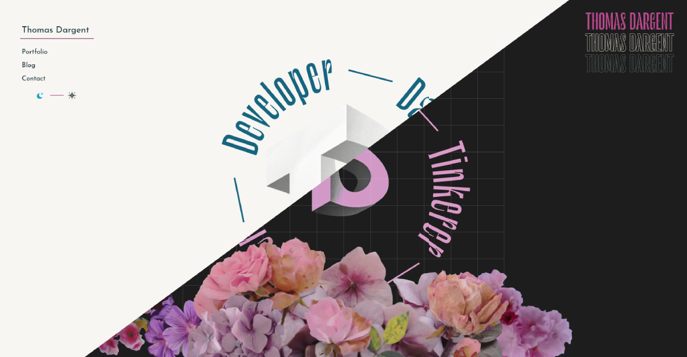

# thomasdargent.com

## About the Website

This website is my little corner of the word wide web, where I:

- Write blog posts about programming, scientific research, personal projects, and everything that I deemed worth sharing at the time.
- Maintain a portfolio section showcasing my professional and creative work.
- Experiment with unknown technologies to stay on top of it
- Host mini-projects and interactive tools.

Feel free to explore, read, and interact!

## Technology Stack

- **Frontend**: HTML, CSS, JavaScript, Typescript, Vue.js (for interactive components)
- **Backend**: Flask (Python) for dynamic features
- **Static Site Generation**: Jupyter notebook to HTML with Quarto
- **Styling**: Tailwind CSS
- **Bundler**: Parcel
- **Hosting**: Digital Ocean
- **Testing**: Puppeteer for accessibility and browser tests, Pytest for server-side testing

## Setup Instructions

If someone try to to use some of this as a basis for something else...

### Prerequisites

- [Node.js](https://nodejs.org/) and npm
- [Python 3.12](https://www.python.org/) for backend

### Steps

1. Clone the repository
2. Install dependencies for the static website: `npm install`
3. Run the static website locally:

- `npm run watchCSS`: to update the tailwind file if you change classes inside a html file
- `npm run devBundle`: to launch the development server of parcel (and display static pages)
- `npm run devFlask`: to run the development server of Flask

4. Run:

- `npm run buildBundle`: to build the static files, and put everything in a dist folder
- `npm run fullBuild`: same thing if you edited or wrote a new article

5. `npm run deploy` need to be adapted to your server configuration. Right now it send everything to my ~ directory, then move it to /var/www/, and write to a .updated file. A watcher catch this change and reload the server.

## Contributing

Uh... I guess contact me?

## License

This project is licensed under the GNU General Public License v3.0. See the [LICENSE](COPYING) file for details.

## Contact

If you have any questions, suggestions, or just want to say hi, feel free to reach out:

- Email: thomas@dargent.xyz
- LinkedIn: [Thomas Dargent](https://www.linkedin.com/in/thomas-dargent1/)
